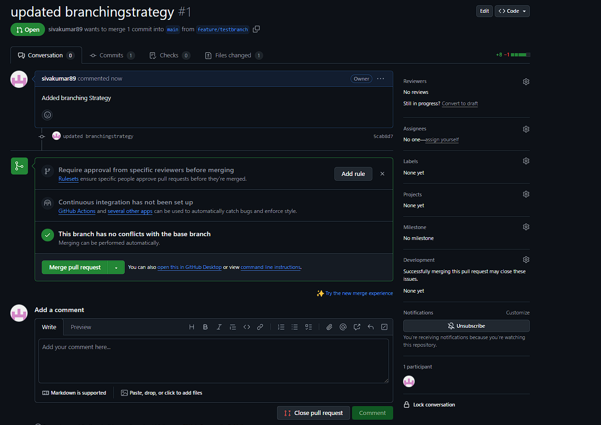

# DevOps
# Branching Strategy

## Branch Types
- **Main Branch:** The primary branch where the stable, production-ready code resides.
- **Feature Branches:** Used for new features (e.g., `feature/testbranch`).
- **Bugfix Branches:** Used to address specific issues (e.g., `bugfix/fix-login-error`).
- **Hotfix Branches:** For critical fixes on production (e.g., `hotfix/security-patch`).

